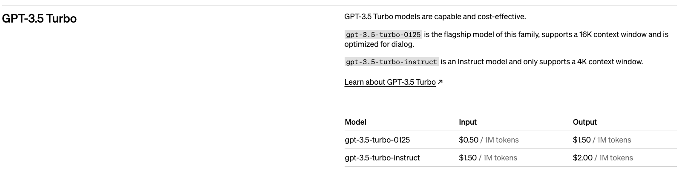
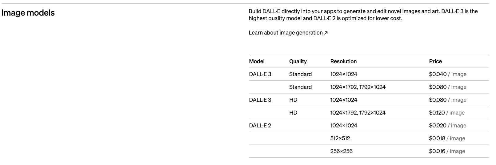

# Inteligencia artificial: Generación de Prompts
<p style="text-align: center;">Curso 67075</p>
<p style="text-align: center;">Idea Alquímica: Tejiendo el Futuro con Prompt Engineering</p>

<h2><p style="text-align: center;">Crónicas del Estudiante de Ingeniería<br/>Generación Automática de Contenido</p></h2>
<p style="text-align: center;"></p>
<h3><p style="text-align: center;">Raúl Andrés De Roovers<br/>Pre Entrega 1</p></h3>

<div style="page-break-before:always">&nbsp;</div>
<p></p>

## El Problema
Durante el `Curso 66130, Fundamentos de Inteligencia Artificial`, se desarrolló un blog con relatos de estudiantes de ingeniería:
* https://cronicasestudianteingenieria.framer.ai/

El siguiente paso para darle vida a este blog es alimentarlo frecuentemente (incorporando al menos un relato por semana) con una gran cantidad de relatos de diferentes estudiantes que puedan enriquecer la experiencia del usuario que visita el sitio, al poder leer experiencias mucho más variadas y numerosas.
El problema en cuestión incluye la generación de los siguientes ítems:
* Perfil del estudiante: Nombre, Apellido, Nacionalidad y Edad
* Bio del estudiante
* Foto de perfil del estudiante
* Relato (acompañado de un título)

Inicialmente, la generación de la información recién mencionada consiste en un proceso manual, a través del cual la persona encargada de mantener el sitio debe iniciar sesión en una herramienta de generación de texto y utilizar un prompt para generar los datos necesarios, incluyendo la solicitud de un prompt que sirva para generar una imagen de perfil del estudiante. Luego, esta misma persona debe iniciar sesión en una herramienta de generación de imágenes a partir de texto, para mediante la introducción del prompt recién generado, obtener la imagen de perfil para este nuevo estudiante.

Además, como parte del mismo proceso manual, el encargado de mantenimiento del sitio debe subir esta información a un repositorio y notificar de alguna manera al mismo sitio para que actualice el relato de la semana, utilizando la información recién generada.

Este proceso manual puede ser reemplazado por un proceso automático que permita al encargado de mantenimiento dirigir su atención y utilizar su tiempo en tareas de mantenimiento y mejora del sitio, incluso de publicidad; incorporando valor desde otras áreas y eliminando la repetición de una tarea sistemática.

<div style="page-break-before:always">&nbsp;</div>
<p></p>

# La Solución
En este contexto, se plantea como solución la utilización de modelos de IA que conviertan texto a texto y texto a imágenes, y nos permitan solucionar el problema en cuestión de manera inmediata y contando con una “base de datos” (de estudiantes y relatos) virtualmente infinita.

El objetivo principal será la generación mediante la utilización de herramientas de IA, de un perfil de estudiante, que estará compuesto por:
* Nombre y apellido
* Edad
* País de origen
* Bio

Al mismo tiempo, se pretende obtener un relato único para dicho estudiante, que cuente con un título propio y significativo.

El primer paso concluirá con un prompt, que nos permita generar una foto de perfil representativa del estudiante que acabamos de crear.

Finalmente, se utilizará este prompt para generar una foto de perfil que acompañe los datos del estudiante, su bio y su relato.

Queda fuera del alcance de la presente solución, el proceso de carga de los datos obtenidos al sitio web, como también la configuración de un timer para la ejecución del programa/script en cuestión, la actualización del blog y una posible notificación a los potenciales suscriptores.

### Prompts a utilizar
#### Contexto
Se le indicará a la IA que se trata de un asistente de generación de contenido para un blog de relatos de estudiantes de ingeniería que semanalmente incorpora relatos acompañados con los datos y una foto de perfil del estudiante.
##### Preliminar
```
Eres un asistente de generación de contenido para un blog de relatos de estudiantes de ingeniería, que incorpora semanalmente el relato de un estudiante incluyendo además los datos de perfil y una foto del mismo
```

#### Prompt inicial
Se le solicitará a la IA que genere un perfil ficticio de un estudiante de ingeniería, indicando su nombre, apellido, país de origen y bio (indicando el límite de longitud); con un formato específico. Este formato nos permite ahorrar tokens en el output, al eliminar principalmente los encabezados, dado que serán siempre los mismos y en la misma posición.
##### Preliminar
```
Necesito:
* Nombre, apellido, edad, país de origen y bio de un estudiante ficticio; la bio debe tener 60 palabras. Presenta el resultado en formato CSV sin encabezados
* Relato de 250 palabras en primera persona con su respectivo título de una experiencia del estudiante
* Prompt de 50 palabras para generar imagen de perfil detallada del estudiante
```

#### Prompt final
Se le solicitará a la IA que genere una imagen de perfil para el estudiante recién creado, utilizando el prompt que hemos obtenido en el paso anterior.

<div style="page-break-before:always">&nbsp;</div>
<p></p>

## Análisis de Viabilidad
Para analizar la viabilidad de la solución propuesta, tendremos en cuenta principalmente dos variables: tiempo y recursos.
### Tiempo
#### Implementación
**En base a los conocimientos previos** del lenguaje Python, de la utilización de IDEs como Visual Studio Code y a la interacción con APIs; **el desarrollo del código fuente** que interactúe con la API de OpenAI **constituye una tarea de dificultad baja, siendo su duración de dos días aproximadamente**.

La estimación está basada en la cantidad y dificultad de los pasos que hemos visto en clase, donde una vez obtenida una API Key, necesitamos definir un contexto y luego los prompts a utilizar.

Al mismo tiempo, dada la propuesta de solución, la lógica a implementar constaría de tan solo dos llamadas a la API de OpenAI:
1. Obtención de datos de perfil, bio, relato y prompt
2. Generación de imagen de perfil

En medio de estas dos llamadas, solo sería necesario un mínimo procesamiento de la primera respuesta, para separar los datos puntuales y extraer el prompt a utilizar en la segunda llamada.

#### Definición de Prompts
Las **pruebas preliminares consumieron** un aproximado de **dos días** para la obtención de los prompts necesarios para obtener los resultados deseados.
Se estima que la **optimización de** estos **prompts** consumirá un **máximo de un día**.

### Recursos
#### Herramientas
##### ChatGPT (web)
Se utilizará ChatGPT web para las pruebas preliminares que nos permitan definir los prompts a utilizar, ya que su uso es libre y gratuito y podremos realizar tantas pruebas como sea necesario para optimizar nuestros prompts.
* https://chat.openai.com/

##### Visual Studio Code
Se utilizará este IDE para la implementación del código en Python que concentre los prompts y realice las sucesivas llamadas a la API de OpenAI para obtener y recopilar los resultados deseados. También es importante en este punto, no sólo la gratuidad de Visual Studio Code sino la facilidad que presenta en la incorporación de plugins y la familiaridad del desarrollador para con la herramienta.
* https://code.visualstudio.com/

##### Conda
Será utilizado para poder administrar los paquetes y entornos de Python.
* https://docs.conda.io/en/latest/

##### Texto a Texto
Para la generación de texto se utilizará la API de GPT-3:
* GPT-3.5 Turbo: gpt-3.5-turbo-0125

Esta elección se basa en que se trata de la versión estándar, que presenta resultados acorde a las necesidades de nuestro proyecto y también un costo menor al de la versión *gpt-3.5-turbo-instruct* y mucho menor a los modelos *GPT-4* y *GPT-4 Turbo*.
* https://platform.openai.com/docs/guides/text-generation/chat-completions-api
    
##### Texto a Imagen
Para la generación de imágenes se utilizará la API de DALL-E:
* DALL·E 3, Standard, 1024×1024

Se decidió utilizar esta versión en particular para poder aprovechar un modelo de IA más reciente (en comparación con DALL·E 2), pero al mismo tiempo manteniendo los costos controlados, dado que imágenes con una resolución de 1024x1024 son más que suficientes para cubrir nuestras necesidades y expectativas.
* https://platform.openai.com/docs/guides/images?context=node

##### Costos
Para el cálculo de los costos se utilizará la documentación de OpenAI.
* https://openai.com/pricing

##### Estimación de palabras
Para el cálculo de la cantidad de palabras de cada fragmento se utilizará Quillbot - Word Counter.
* *https://quillbot.com/word-counter

##### Cálculo de tokens
Para el cálculo de la cantidad de tokens insumidos se utilizará Tokenizer (de OpenAI).
* https://platform.openai.com/tokenizer

#### Costos
Basándonos en el sitio ya existente (https://cronicasestudianteingenieria.framer.ai/), tomamos los siguientes valores promedio para cada fragmento de texto:
* Bio: 60 palabras
* Relato: 250

Arbitrariamente definimos una extensión máxima de 50 palabras para el prompt que nos permita generar una imagen de perfil.

En forma preliminar y teniendo en cuenta el contexto y el prompt presentados en la sección Prompts a utilizar dentro de La Solución, consideramos un input de:
* Contexto: 50 tokens
* Prompt: 83 tokens
* Total: 133 tokens

También durante pruebas preliminares, obtuvimos respuestas de alrededor de 650 tokens.

En base a los datos mencionados, proponemos una estimación “hacia arriba” en la cantidad de tokens, para cubrir una mayor cantidad de escenarios, considerando que tanto el país de origen como el nombre del estudiante y también el relato y su respectivo título, pueden variar en longitud. Proponemos entonces los siguientes valores:
* Input: 140 tokens
    * Contexto: 50
    * Prompt: 83
    * Total: 133 ~ 140
* Output: 700 tokens
    * Respuesta promedio: 650 ~ 700

Consultando entonces la documentación de OpenAI, vemos los siguientes valores:





Podemos entonces definir nuestros costos en base a la siguiente tabla:

| Concepto    | Tokens | Valor | Subtotal |
| -------- | ------- | -------- | -------- |
| Input | 140    | $0.5/1M | 0.00007 |
| Output | 700     | $1.5/1M | 0.00105 |
| Imagen    | -    | $0.04/imagen | 0.04 |
| TOTAL | | | 0.04112 |

Concluimos entonces que con cada generación de un estudiante (incluyendo sus datos de perfil, relato y foto) incurrimos en un gasto de $0.04112 dólares.

Considerando que la actualización del blog se realiza en forma semanal, y considerando un promedio de 53 semanas al año, obtenemos el siguiente costo anual:
* $2.17936 (dólares)

<div style="page-break-before:always">&nbsp;</div>
<p></p>

## Conclusión
En base al análisis anterior, podemos concluir que un tiempo de desarrollo cercano pero inferior a una semana con un costo de mantenimiento anual apenas superior a los dos dólares, resulta absolutamente viable.